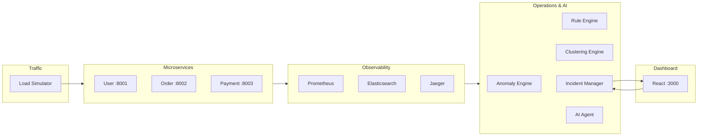
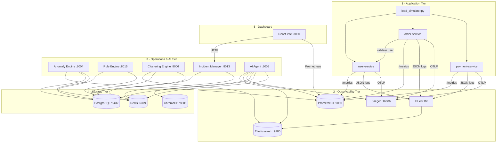
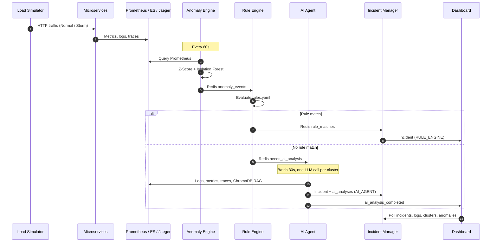
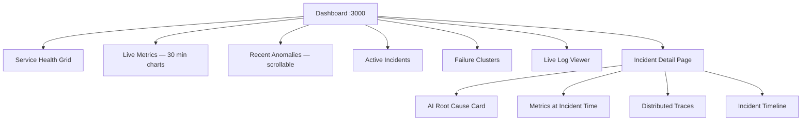

# Rootly-AI

**Rootly-AI** is an AI-assisted API monitoring and incident response platform. It simulates a microservices e-commerce stack, ingests metrics, logs, and traces, detects anomalies, clusters failures, and uses an LLM (Groq) to produce root-cause analysis with actionable debugging steps — all surfaced through a real-time React dashboard.



---

## What It Does

| Capability | Description |
|------------|-------------|
| **Synthetic workload** | Load simulator drives user, order, and payment APIs in Normal and Storm modes |
| **Telemetry collection** | Prometheus metrics, JSON logs via Fluent Bit → Elasticsearch, OpenTelemetry traces → Jaeger |
| **Anomaly detection** | Z-Score and Isolation Forest over latency, error rate, DB errors, gateway timeouts |
| **Deterministic rules** | Rule engine matches known failure patterns (DB saturation, cascade, circuit breaker, gateway degradation) |
| **AI root-cause analysis** | Groq LLM with RAG (ChromaDB), logs, metrics, and traces — batched, not per-event |
| **Failure clustering** | Sentence-transformer embeddings + FAISS group similar error logs |
| **Incident lifecycle** | Open → Acknowledged → Resolved with escalation and resolution memory |
| **Live dashboard** | Service health, metrics charts, anomalies, incidents, clusters, log viewer, incident detail with AI RCA |

---

## Architecture at a Glance



For full service descriptions, Redis channels, algorithms, schemas, and API reference, see **[architecture.md](./architecture.md)**.

---

## Prerequisites

- **Docker Desktop** (with Compose v2)
- **Node.js 18+** and **npm** (dashboard)
- **Python 3.11+** (load simulator on host)
- **Groq API key** ([console.groq.com](https://console.groq.com)) for AI root-cause analysis

---

## Quick Start

### 1. Configure environment

```powershell
cd monitoring-system
copy .env.example .env
```

Edit `.env` and set at minimum:

```env
GROQ_API_KEY=your_groq_api_key_here
GROQ_MODEL=llama-3.3-70b-versatile
LLM_PROVIDER=groq
```

All internal service URLs in `.env.example` use Docker Compose hostnames (`postgres`, `redis`, `elasticsearch`, etc.) and should not be changed for containerized services.

### 2. Build and start the stack

ML-heavy images (`torch`, `sentence-transformers`, `faiss`, `scikit-learn`) are built once into a shared base image:

```powershell
cd monitoring-system
$env:DOCKER_BUILDKIT = "1"
$env:COMPOSE_DOCKER_CLI_BUILD = "1"
docker compose build ml-base
docker compose up -d --build
```

Verify services are running:

```powershell
docker compose ps
curl.exe http://127.0.0.1:8013/health
```

Expected response: `{"status":"ok","service":"incident-manager"}`

> **Windows note:** Use `127.0.0.1` instead of `localhost` when calling APIs from the host. IPv6 localhost can cause connection stalls on port 8013.

### 3. Start the load simulator

Run from your host machine (not inside Docker) to generate traffic:

```powershell
cd monitoring-system/services
python load_simulator.py
```

The simulator runs **15 concurrent workers** and toggles between **Normal** and **Storm** mode every **30 seconds**:

- **Normal** — steady mixed traffic across user, order, and payment endpoints
- **Storm** — heavy payment gateway calls, user-service timeouts, and cascading order failures

### 4. Start the dashboard

```powershell
cd monitoring-system/dashboard
npm install
npm run dev
```

Open **http://localhost:3000**

The dashboard reads `dashboard/.env.development`:

```env
VITE_API_URL=http://127.0.0.1:8013
VITE_WS_URL=ws://127.0.0.1:8013
```

---

## End-to-End Data Flow



---

## Service Port Reference

| Service | Host Port | Purpose |
|---------|-----------|---------|
| User Service | 8001 | User lookup, login, DB timeout simulation |
| Order Service | 8002 | Order creation and retrieval |
| Payment Service | 8003 | Payment processing, gateway timeout simulation |
| Anomaly Engine | 8004 | Metric anomaly detection API + scheduler |
| ChromaDB | 8005 | Vector store for incident RAG memory |
| Clustering Engine | 8006 | Log clustering API + scheduler |
| Incident Manager | **8013** | Central API, logs, incidents, WebSocket bridge |
| AI Agent | 8008 | LLM root-cause analysis API |
| Rule Engine | **8015** | Deterministic rule evaluation |
| Prometheus | 9090 | Metrics storage and query |
| Grafana | 3001 | Pre-provisioned dashboards (admin / admin123) |
| Jaeger UI | 16686 | Distributed trace visualization |
| Elasticsearch | 9200 | Log index storage |
| PostgreSQL | 5432 | Operational data store |
| Redis | 6379 | Pub/Sub event bus and deduplication |
| **Dashboard** | **3000** | React monitoring UI (run locally via Vite) |

---

## Dashboard Features



| View | Data source |
|------|-------------|
| Service Health | Prometheus + incident stats (error rate blends 4xx/5xx with critical incident count) |
| Live Metrics | Prometheus range queries (error rate, p95 latency, request volume) |
| Recent Anomalies | Incident Manager `/anomalies` |
| Active Incidents | Incident Manager `/incidents` with acknowledge / resolve |
| Failure Clusters | Incident Manager `/clusters` (PostgreSQL `failure_clusters`, fallback to open incidents) |
| Live Log Viewer | Elasticsearch via `/logs` with file-log fallback from shared `/logs` volume |
| Incident Detail | Full context: AI analysis, debug steps, recommended actions, evidence, traces |

---

## Project Structure

```
Rootly-AI/
├── README.md                    ← This file
├── architecture.md              ← Full architecture & implementation reference
└── monitoring-system/
    ├── docker-compose.yml       ← All Docker services
    ├── .env.example             ← Environment template
    ├── init_scripts/            ← PostgreSQL + Elasticsearch bootstrap
    ├── services/                ← Monitored microservices + load simulator
    ├── collector/               ← Prometheus, Fluent Bit, Grafana configs
    ├── anomaly_engine/          ← Z-Score + Isolation Forest detectors
    ├── rule_engine/             ← Deterministic rules (rules.yaml)
    ├── clustering_engine/       ← FAISS log clustering
    ├── incident_manager/        ← Incident API, lifecycle, log search
    ├── ai_agent/                ← Groq LLM agent + batch processor + RAG
    ├── alert_system/            ← Slack/email alerters (not deployed in compose)
    └── dashboard/               ← React (Vite) frontend
```

---

## Verification Checklist

After starting the stack and load simulator, confirm the pipeline is healthy:

```powershell
# Incident manager health
curl.exe http://127.0.0.1:8013/health

# Logs flowing (may take ~10s after simulator start)
curl.exe "http://127.0.0.1:8013/services/user-service/logs?limit=3"

# Open incidents
curl.exe "http://127.0.0.1:8013/incidents?status=OPEN&limit=5"

# Anomalies
curl.exe "http://127.0.0.1:8013/anomalies?limit=5"

# Failure clusters
curl.exe "http://127.0.0.1:8013/clusters?status=open&limit=5"

# Prometheus targets
curl.exe http://127.0.0.1:9090/api/v1/targets
```

---

## Troubleshooting

| Symptom | Fix |
|---------|-----|
| Dashboard API timeouts | Use `127.0.0.1:8013`, not `localhost:8013` (Windows IPv6 issue) |
| Empty log viewer | Run load simulator; wait ~10s for Fluent Bit flush; try filtering to a single service |
| No anomalies / incidents | Simulator must be running (engines skip detection when request rate &lt; 0.1/s) |
| AI analysis missing | Set `GROQ_API_KEY` in `.env`; restart `ai-agent` container |
| Docker build fails on pip | Use volume mount for `incident_manager` (already configured); avoid full rebuild unless needed |
| Incident manager code changes | `docker compose up -d incident-manager` picks up volume-mounted source |

Restart a single service:

```powershell
docker compose restart incident-manager ai-agent anomaly-engine
```

View logs:

```powershell
docker compose logs -f incident-manager ai-agent anomaly-engine
```

---

## Technology Stack

| Layer | Technologies |
|-------|-------------|
| Microservices | FastAPI, OpenTelemetry, Prometheus client, Circuit Breaker |
| Observability | Prometheus, Elasticsearch, Fluent Bit, Jaeger, Grafana |
| Data stores | PostgreSQL, Redis, ChromaDB |
| ML / AI | scikit-learn, FAISS, SentenceTransformers, Groq (Llama 3.3 70B) |
| Orchestration | Docker Compose, APScheduler, Redis Pub/Sub |
| Frontend | React 18, Vite, Recharts, Axios |

---

## Documentation

- **[architecture.md](./architecture.md)** — Complete system architecture, Redis event bus, algorithms, database schemas, API endpoints, directory layout, and implementation details.

---

## License

See repository license file for terms.
