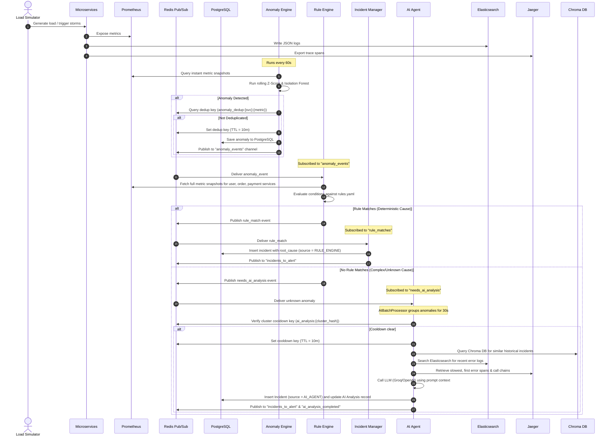

# Rootly-AI Architecture & Flow Reference Guide

This document describes the complete architecture, data schemas, telemetry routing flows, and operational algorithms implemented in the **Rootly-AI Monitoring System**.

---

## 1. System Topology & Tiers

The system is organized into three distinct tiers that interact asynchronously via network APIs, database operations, and a central Redis Event Bus:

```mermaid
flowchart TB
    subgraph MonitoredApp ["1. Monitored Application Tier"]
        LS[load_simulator.py] -->|traffic| US[user_service :8001]
        LS -->|traffic| OS[order_service :8002]
        LS -->|traffic| PS[payment_service :8003]
        OS -->|REST| US
        PS -.->|Gateway API| EXT[External Payment Gateway]
    end

    subgraph Observability ["2. Observability Infrastructure Tier"]
        PROM[(Prometheus :9090)]
        ES[(Elasticsearch :9200)]
        JG[Jaeger :16686]
        FB[Fluent Bit]
    end

    subgraph Operations ["3. Operations & AI Engine Tier"]
        AE[Anomaly Engine :8004]
        RE[Rule Engine :8015]
        CE[Clustering Engine :8006]
        IM[Incident Manager :8013]
        AI[AI Agent :8008]
    end

    subgraph Storage ["4. Storage & State Store Tier"]
        PG[(PostgreSQL :5432)]
        RD[(Redis :6379)]
        CH[(ChromaDB :8005)]
    end

    subgraph UI ["5. Presentation Tier"]
        DASH[React Vite Dashboard :5173]
    end

    %% Ingestion Routing
    US & OS & PS -->|metrics| PROM
    US & OS & PS -->|OTLP spans| JG
    US & OS & PS -->|JSON logs| FB -->|index| ES

    %% Operations Telemetry Pull
    AE -->|scrape metrics| PROM
    CE -->|fetch logs| ES
    AI -->|RAG memory query| CH
    AI -->|fetch logs| ES
    AI -->|fetch metrics| PROM
    AI -->|fetch traces| JG

    %% Orchestration Event Bus (Redis) & DB Storage
    AE -->|publish anomaly_events| RD
    AE -->|upsert anomalies| PG
    RE -->|subscribe anomaly_events| RD
    RE -->|publish rule_matches| RD
    RE -->|publish needs_ai_analysis| RD
    IM -->|subscribe rule_matches / needs_ai| RD
    IM -->|upsert incidents| PG
    IM -->|publish incidents_for_ai / incidents_to_alert| RD
    AI -->|subscribe incidents_for_ai| RD
    AI -->|upsert incidents / analyses| PG
    AI -->|publish incidents_to_alert| RD
    CE -->|upsert clusters| PG
    CE -->|publish cluster_updates| RD

    %% UI Connections
    DASH -->|API calls| IM
    DASH -->|direct metrics| PROM
```



### The Tiers
1. **Monitored Application Tier**: 
   - Generates steady-state synthetic transactions (`load_simulator.py`) cycling between normal operation (8 mins) and storm workloads (2 mins).
   - Simulates realistic failure domains: database timeouts in the `user-service`, cascading failures in `order-service` when it validates orders downstream, and network timeouts/declines in the `payment-service`.
   - Incorporates resilience patterns like **Circuit Breakers** which trip (503 status code) under high failure rates.
2. **Observability Infrastructure Tier**:
   - Collects metric values, logs, and distributed traces from application runtimes.
   - Prometheus scrapes endpoints, Fluent Bit maps volume-mapped JSON log files to Elasticsearch indexes, and Jaeger collects trace spans.
3. **Operations & AI Engine Tier**:
   - Runs asynchronous, schedule-driven engines detecting telemetry changes, matching deterministic rules, clustering logs using machine learning, and utilizing LLMs to diagnose complex root causes.
4. **Storage & State Store Tier**:
   - PostgreSQL preserves tabular states (anomalies, failure clusters, incidents, analyses).
   - Redis acts as the messaging backbone (Pub/Sub channels) and deduplication coordinator.
   - Chroma DB acts as the RAG memory context holder.
5. **Presentation Tier**:
   - Offers single-page React visual interfaces where operators track incidents, review metrics/traces/logs, examine AI summaries, and trigger lifecycle state changes (acknowledge / resolve).

---

## 2. Telemetry Flow & Formats

### Logs
Application code formats structured JSON outputs directly. Example structure:
```json
{
  "timestamp": "2026-05-24T14:12:19.456Z",
  "level": "ERROR",
  "service": "user-service",
  "message": "DB connection timeout after 30s",
  "endpoint": "/users/12345",
  "status_code": 500,
  "latency_ms": 30000.0,
  "trace_id": "8f9a2b7c4d5e6f8a"
}
```
Fluent Bit scans these files, parses them as JSON, and streams them to Elasticsearch indices formatted as `api-logs-user-service-*`.

### Metrics
Services expose Prometheus-compliant metric formats scraped on `/metrics`:
- `http_requests_total` (labeled by `job`, `status`)
- `http_request_duration_seconds_bucket` (labeled by `job`, `le` for latency metrics)
- `db_connection_errors_total` (labeled by `service`)
- `payment_gateway_timeouts_total` (labeled by `service`)

### Traces
Applications use the OpenTelemetry Python SDK, sending context-propagated spans to Jaeger via gRPC (`otlp-grpc` on port 4317). When `order-service` calls `user-service`, it forwards the `traceparent` headers so child spans link perfectly to parent trace models.

---

## 3. Operations Event Pipeline (Detailed Step-by-Step)



---

## 4. Key Diagnostic & Analytics Algorithms

### 1. Metric Anomaly Detection
The Anomaly Engine runs two detection modes every 60 seconds:
*   **Rolling Z-Score**: Evaluates univariate series (e.g., `p95_latency_ms`). It keeps a double-ended queue (`deque(maxlen=30)`) of historical measurements. 
    $$\mu = \text{mean}(window), \quad \sigma = \text{std\_dev}(window), \quad Z = \frac{x - \mu}{\sigma}$$
    - $Z > 3 \rightarrow$ **CRITICAL**
    - $Z > 2 \rightarrow$ **WARNING**
*   **Multivariate Isolation Forest**: Analyzes all service metrics simultaneously using `scikit-learn`. Trains a forest model (`contamination=0.05`) every 24 hours on historical metric snapshots. Predicts outliers (score $\le -0.2 \rightarrow$ **CRITICAL**, score $> -0.2 \rightarrow$ **WARNING**).

### 2. Disjoint Set Union (DSU) Log Clustering
The Clustering Engine aggregates logs to identify repeated failure signatures:
*   Pulls error logs for the last 30 minutes from Elasticsearch.
*   Encodes log statements into dense vectors (384-dimensional) using SentenceTransformers (`all-MiniLM-L6-v2`).
*   Loads embeddings into a FAISS Inner Product Flat index (`faiss.IndexFlatIP`) for rapid $K$-nearest neighbor similarity lookups.
*   Groups logs into equivalence classes if their cosine similarity exceeds `0.85`, linking components using a Union-Find (DSU) algorithm.
*   Elects the centroid (the sample closest to the average vector) as the cluster representative.

### 3. RAG Retrieval & LLM Diagnosis
When a cluster of anomalies requires AI analysis:
1.  **Similarity Retrieval**: Incident titles are converted to embeddings. The agent queries Chroma DB's `incident_memory` collection using cosine similarity. Matching documents with distance $< 0.30$ (similarity $> 0.70$) are fetched.
2.  **Context Construction**: Aggregates metric state values, gets up to 10 latest Elasticsearch error logs, and queries Jaeger's trace endpoint.
3.  **Prompt & Call**: Formulates a detailed prompt providing all observability metrics, call chains, error message samples, and past incident histories. Invokes the LLM to get a structured JSON diagnostic block.
4.  **Memory Insertion**: When an operator resolves an incident through the dashboard, the Incident Manager publishes to `incidents_resolved`. The AI Agent captures this event, combines the incident's title, diagnosed root cause, and operator's manual resolution notes, embeds the text, and stores it in Chroma DB for future RAG queries.

---

## 5. Storage Schema Reference

### Anomalies Table (`anomalies`)
Tracks metric spikes detected by the Anomaly Engine:
```sql
CREATE TABLE anomalies (
    id UUID PRIMARY KEY DEFAULT gen_random_uuid(),
    service VARCHAR(100) NOT NULL,
    metric VARCHAR(100) NOT NULL,
    current_value FLOAT NOT NULL,
    mean FLOAT NOT NULL,
    std FLOAT NOT NULL,
    z_score FLOAT,
    anomaly_score FLOAT,
    severity VARCHAR(20) NOT NULL,
    detector VARCHAR(50) NOT NULL,
    timestamp TIMESTAMPTZ NOT NULL DEFAULT NOW(),
    created_at TIMESTAMPTZ NOT NULL DEFAULT NOW()
);
```

### Failure Clusters Table (`failure_clusters`)
Maintained by the Clustering Engine to group similar error logs:
```sql
CREATE TABLE failure_clusters (
    id UUID PRIMARY KEY DEFAULT gen_random_uuid(),
    representative_message TEXT NOT NULL,
    member_count INTEGER NOT NULL DEFAULT 1,
    affected_services TEXT[] NOT NULL,
    status VARCHAR(20) NOT NULL DEFAULT 'open',
    first_seen TIMESTAMPTZ NOT NULL DEFAULT NOW(),
    last_seen TIMESTAMPTZ NOT NULL DEFAULT NOW()
);
```

### Incidents Table (`incidents`)
Core tracking entity representing active service outages:
```sql
CREATE TABLE incidents (
    id UUID PRIMARY KEY DEFAULT gen_random_uuid(),
    title VARCHAR(500) NOT NULL,
    status VARCHAR(20) NOT NULL DEFAULT 'OPEN', -- OPEN, ACKNOWLEDGED, RESOLVED
    severity VARCHAR(20) NOT NULL,               -- WARNING, CRITICAL
    affected_services TEXT[] NOT NULL,
    cluster_id UUID REFERENCES failure_clusters(id),
    root_cause TEXT,
    confidence FLOAT,
    source VARCHAR(20) NOT NULL,                 -- RULE_ENGINE, AI_AGENT
    similar_incident_ids UUID[],
    alert_sent BOOLEAN DEFAULT FALSE,
    resolution_notes TEXT,
    created_at TIMESTAMPTZ NOT NULL DEFAULT NOW(),
    acknowledged_at TIMESTAMPTZ,
    resolved_at TIMESTAMPTZ
);
```

### AI Analyses Table (`ai_analyses`)
Keeps detailed outputs from LLM reasoning calls linked to incidents:
```sql
CREATE TABLE ai_analyses (
    id UUID PRIMARY KEY DEFAULT gen_random_uuid(),
    incident_id UUID REFERENCES incidents(id),
    root_cause TEXT NOT NULL,
    severity VARCHAR(20) NOT NULL,
    confidence FLOAT NOT NULL,
    affected_services TEXT[] NOT NULL DEFAULT '{}',
    recommended_actions TEXT[] NOT NULL DEFAULT '{}',
    summary TEXT,
    raw_response JSONB,
    created_at TIMESTAMPTZ NOT NULL DEFAULT NOW()
);
```
