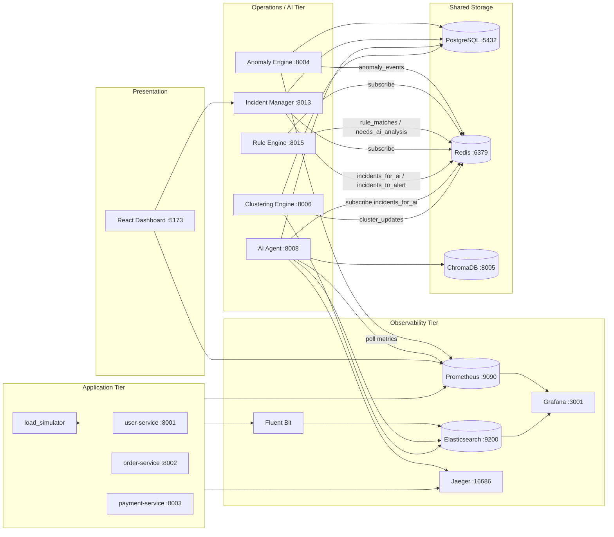
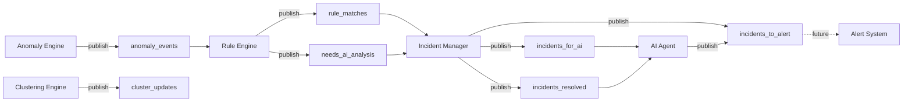
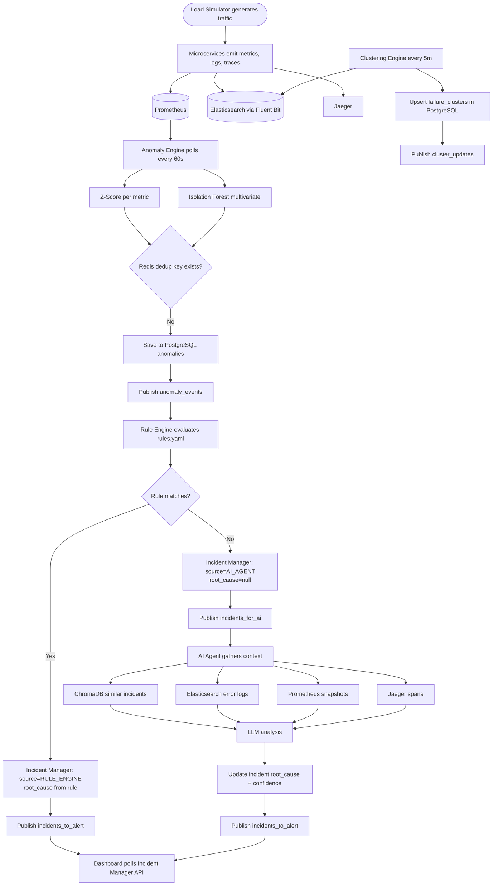
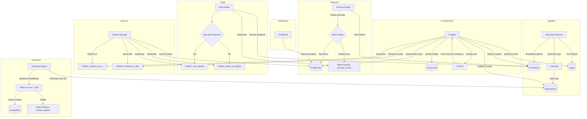
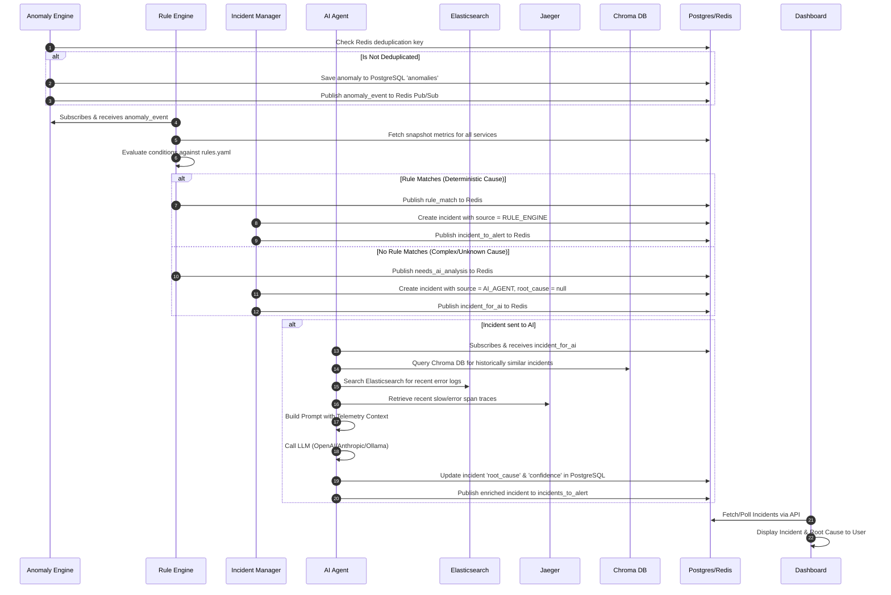

# Rootly-AI Monitoring System: Implementation & Architecture Guide

Welcome to the **Rootly-AI Monitoring System** guide. This document provides a complete breakdown of the system architecture, directory structure, data flows, operational microservices, algorithms, and step-by-step instructions on how to run and verify each service.

---

## 1. Project Directory Structure

The repository is organized into a monitored application tier, an AI-assisted operations tier, and a shared observability infrastructure tier.

```text
monitoring-system/
├── docker-compose.yml           # Infrastructural services & monitored microservices
├── .env.example                 # Environment variables template
├── init_scripts/                # Database initialization scripts
│   ├── create_es_template.py    # Registers templates in Elasticsearch
│   └── create_pg_tables.py      # Creates SQL tables/indexes in PostgreSQL
├── services/                    # Monitored core application services
│   ├── load_simulator.py        # Generates normal & storm synthetic traffic
│   ├── user_service/            # FastAPI, DB/auth simulations, circuit-breaker
│   ├── order_service/           # FastAPI, business workflows
│   └── payment_service/         # FastAPI, payment gateway simulation
├── collector/                   # Configuration files for telemetry collectors
│   ├── prometheus.yml           # Prometheus scraping targets and intervals
│   ├── fluent_bit/              # Fluent Bit parsing and routing configs
│   └── grafana/                 # Grafana dashboard provisioning files
├── anomaly_engine/              # Polls metrics, runs Z-Score and Isolation Forest detectors
├── rule_engine/                 # Matches anomalies against rules.yaml, otherwise routes to AI
├── clustering_engine/           # Clusters Elasticsearch logs using FAISS and sentence-transformers
├── incident_manager/            # Manages incident lifecycle (DB writes, state transitions, escalations)
├── ai_agent/                    # LLM RAG agent analyzing telemetry (traces, metrics, logs) for root causes
├── alert_system/                # (SKIPPED FOR NOW) Alert deduplication and notification dispatcher
└── dashboard/                   # React (Vite) single-page application dashboard
```

---

## 2. Shared Infrastructure Services

The core infrastructure is defined in the root [docker-compose.yml](file:///e:/Rootly-AI/monitoring-system/docker-compose.yml). It provisions:

1. **PostgreSQL** (`port 5432`): Stores structured operational data for `anomalies`, `failure_clusters`, and `incidents`.
2. **Redis** (`port 6379`): Serves as the message broker (Pub/Sub channels for system coordination) and caches SentenceTransformer embeddings.
3. **Elasticsearch** (`port 9200`): Indexes JSON log lines parsed and shipped by Fluent Bit.
4. **Fluent Bit**: Tail-reads application log files in the shared `/logs` volume and ships them to Elasticsearch under `api-logs-*` indexes.
5. **Chroma DB** (`port 8005`): Vector database storing historical incident documents (title, root cause, resolution) for RAG context retrieval.
6. **Prometheus** (`port 9090`): Scrapes metrics (`/metrics`) from the active microservices every 10 seconds.
7. **Jaeger** (`port 16686` for UI, `4317` for OTLP gRPC): Stores and visualizes distributed trace spans using OpenTelemetry.
8. **Grafana** (`port 3001`): Provisions visual dashboards linked to Prometheus and Elasticsearch.

---

## 3. Monitored Microservices (Application Tier)

These represent the application services whose health and performance are monitored:

*   **User Service** ([main.py](file:///e:/Rootly-AI/monitoring-system/services/user_service/main.py)): Simulates DB connection timeouts (10% rate) causing 30-second delays, handles authentication, and implements a custom Circuit Breaker pattern.
*   **Order Service**: Simulates downstream dependencies on the User Service and handles order workflows.
*   **Payment Service**: Simulates downstream gateway interactions and records simulated timeouts/failures.
*   **Load Simulator** ([load_simulator.py](file:///e:/Rootly-AI/monitoring-system/services/load_simulator.py)): Runs a loop transitioning between **Normal Phase** (8 mins of steady traffic) and **Storm Phase** (2 mins of heavy payment gateway and retrieval calls) to generate telemetry data.

All microservices write logs to a shared docker volume mounted at `/logs/{service_name}.log` using a JSON logger format containing trace context, while exposing metrics to Prometheus and exporting spans to Jaeger.

---

## 4. System Architecture Overview

Rootly-AI is organized into three tiers that work together: simulated applications generate telemetry, observability infrastructure collects it, and the operations/AI tier detects, triages, and diagnoses incidents.

| Tier | Purpose | Key Components |
|------|---------|----------------|
| **Application** | Generate realistic traffic and failures | `user-service`, `order-service`, `payment-service`, `load_simulator.py` |
| **Observability** | Collect metrics, logs, and traces | Prometheus, Fluent Bit → Elasticsearch, Jaeger, Grafana |
| **Operations / AI** | Detect, triage, diagnose, and display | Anomaly Engine → Rule Engine → Incident Manager → AI Agent; Clustering Engine (parallel) |

### High-Level End-to-End Flow

The diagram below shows how all major components connect, including host ports for local access.



### Redis Pub/Sub Event Bus

Redis channels coordinate the event-driven pipeline. Each channel has a single publisher and one or more subscribers.



| Channel | Publisher | Subscriber(s) |
|---------|-----------|---------------|
| `anomaly_events` | Anomaly Engine | Rule Engine |
| `rule_matches` | Rule Engine | Incident Manager |
| `needs_ai_analysis` | Rule Engine | Incident Manager |
| `incidents_for_ai` | Incident Manager | AI Agent |
| `incidents_to_alert` | Incident Manager, AI Agent | Alert System *(skipped for now)* |
| `incidents_resolved` | Incident Manager | AI Agent *(RAG memory)* |
| `cluster_updates` | Clustering Engine | *(future consumers)* |

### Step-by-Step Incident Pipeline

This flowchart walks through the main incident path from detection to dashboard display.



---

## 5. Operational & AI Services (Operations Tier)

These services comprise the event-driven monitoring, detection, and diagnostic pipeline:



---

## 6. Sequence and Data Flow Diagrams

### Incident Detection, Diagnostic, and Alerting Flow

The diagram below details the sequence of actions starting from an anomaly detection up to the dashboard display and resolution.



---

## 7. How to Run Each Service

Follow this guide to get all backend components running in Docker.

### Step 1: Configure Environments
Copy the template configuration file `.env.example` in the directory root to `.env`:
```powershell
cp .env.example .env
```
Set `LLM_API_KEY`, `LLM_MODEL`, and `LLM_BASE_URL` in `.env` for any OpenAI-compatible provider (OpenAI, Groq, xAI Grok, etc.). All internal service URLs in `.env.example` already use Docker Compose hostnames (`postgres`, `redis`, `elasticsearch`, etc.).

### Step 2: Spin Up All Services in Docker

Heavy ML dependencies (`torch`, `sentence-transformers`, `faiss`, `scikit-learn`) are built once into the shared `rootly-ml-base:local` image. Build that image first, then everything else:

```powershell
$env:DOCKER_BUILDKIT = "1"
$env:COMPOSE_DOCKER_CLI_BUILD = "1"
docker compose build ml-base
docker compose up -d --build
```

After the first build, changing only Python source code reuses cached pip layers — you should not re-download GB-sized packages unless `requirements.txt` or `docker/ml-base-requirements.txt` changes.

Build and launch all background infrastructure, monitored apps, and AI/operations engines:
```powershell
docker compose up -d --build
```
This command builds and runs:
- **Databases**: `postgres` (port 5432), `redis` (port 6379), `elasticsearch` (port 9200), `chromadb` (port 8005)
- **Monitors & Shipping**: `prometheus` (port 9090), `grafana` (port 3001), `jaeger` (port 16686/4317), `fluent-bit`
- **Monitored Services**: `user-service` (port 8001), `order-service` (port 8002), `payment-service` (port 8003)
- **Database Initializer**: `es-init` (sets up Elasticsearch index mappings and PostgreSQL schema)
- **AI & Operations Services**:
  - `anomaly-engine` (port 8004): Runs metric anomaly detectors (Z-Score & Isolation Forest)
  - `rule-engine` (port 8015): Evaluates metric alerts against deterministic rules
  - `clustering-engine` (port 8006): Clusters application error logs using SentenceTransformers & FAISS
  - `incident-manager` (port 8013/8007): Tracks incidents, routes to AI, manages transitions and escalations
  - `ai-agent` (port 8008): Queries logs/traces/memory and calls LLMs for root cause diagnosis
  - *(Note: `alert-system` is skipped for this phase)*

Confirm all services are active and healthy:
```powershell
docker compose ps
```

### Step 3: Run the Traffic Simulator
To feed the metrics and logs pipelines with synthetic traffic data, run the simulator locally on your host:
```powershell
cd services
python load_simulator.py
```

### Step 4: Start the Dashboard
To start the React frontend dashboard locally:
```powershell
cd dashboard
npm install
npm run dev
```
Open [http://localhost:5173](http://localhost:5173) in your browser. Log in with the administrative credentials:
*   **Username**: `admin`
*   **Password**: `admin123`

---


## 8. Operational Algorithms

### 1. Z-Score Metric Detection
For each service and telemetry metric (e.g., `p95_latency_ms`), the [ZScoreDetector](file:///e:/Rootly-AI/monitoring-system/anomaly_engine/zscore_detector.py) keeps a rolling double-ended queue `deque(maxlen=30)`.
$$\mu = \text{mean}(window), \quad \sigma = \text{std\_dev}(window)$$
$$Z = \frac{x - \mu}{\sigma}$$
*   If $Z > 3$, it flags a **CRITICAL** anomaly.
*   If $Z > 2$, it flags a **WARNING** anomaly.

### 2. Multivariate Isolation Forest
The [IsolationForestDetector](file:///e:/Rootly-AI/monitoring-system/anomaly_engine/isolation_forest_detector.py) performs anomaly detection across all five metric dimensions simultaneously.
- **Training**: Every 24 hours, the service fetches the past 7 days of snapshots (step size 5 minutes). It trains an Isolation Forest model (`sklearn.ensemble.IsolationForest`, `contamination=0.05`).
- **Prediction**: Returns a prediction output of $+1$ (inlier) or $-1$ (outlier). Outliers generate an anomaly event where:
  - $\text{Decision Score} < -0.2 \Rightarrow \text{CRITICAL}$
  - $\text{Decision Score} \ge -0.2 \Rightarrow \text{WARNING}$

### 3. FAISS Error Clustering
The [FailureClusterer](file:///e:/Rootly-AI/monitoring-system/clustering_engine/clusterer.py) runs every 5 minutes:
- Grabs logs with error states over the last 30 minutes from Elasticsearch.
- Employs `SentenceTransformer("all-MiniLM-L6-v2")` to convert log messages into 384-dimensional vector representations.
- Creates a FAISS Inner Product Flat index (`faiss.IndexFlatIP`).
- Performs a similarity search ($k$-nearest neighbors) on all embeddings. If cosine similarity between two error lines exceeds `0.85`, it links them into the same equivalence class using a Union-Find data structure.
- Calculates the cluster centroid: the message closest to the centroid is elected as the cluster representative.

### 4. RAG & LLM Diagnostic Logic
When an incident is routed to the AI Agent:
1.  **Retrieve**: Similar incidents are resolved by generating the cosine distance of the incident title against documents in the Chroma DB collection `incident_memory`. Files matching similarity threshold $> 0.70$ (distance $< 0.30$) are fetched.
2.  **Telemetry Fetch**: Aggregates Elasticsearch query counts, Prometheus metrics, and Jaeger spans (identifying the slowest child span, the first span flagging an error, and the call chain sequence).
3.  **Prompt & Classify**: Passes JSON arrays to the LLM. The model output is parsed to populate incident diagnostics, confidence scores, and remediation steps.
4.  **Memorize**: When an operator notes an incident as resolved via the API, the title, root cause, and resolution notes are combined, embedded, and added to the Chroma DB vector store.

---

## 9. Division of Labor & Branching Strategy

Given the 8-hour submission deadline, development is split between API/Infrastructure and AI pipelines, while future features (like the Slack/Email Alert System) are skipped.

### Person A: API, Infrastructure & Frontend Focus
*Goal: Ensure data is generated, stored, and visible.*
*   **Branches**: `feature/api-dashboard` (branched from `development`)
*   **Modules**: `/services`, `/dashboard`, `/incident_manager`, and `/collector`
*   **Focus**: 
    *   Build out React dashboard views to display incidents.
    *   Ensure User, Order, Payment services and Load Simulator run properly.
    *   Finalize Incident Manager APIs for the dashboard.
    *   Validate core infra (PostgreSQL, Elasticsearch, Redis, Prometheus, Grafana, Jaeger).

### Person B: AI & Data Pipeline Focus
*Goal: Ensure anomalies are detected, clustered, and diagnosed by the LLM.*
*   **Branches**: `feature/ai-pipeline` (branched from `development`)
*   **Modules**: `/anomaly_engine`, `/clustering_engine`, `/rule_engine`, and `/ai_agent`
*   **Focus**:
    *   Ensure Anomaly Engine successfully detects and writes events.
    *   Set up Clustering Engine with FAISS for grouping Elasticsearch errors.
    *   Finalize AI Agent RAG pipeline (fetching Chroma DB, parsing logs, and writing root causes to DB).
    *   Implement complex rule engine logic (routing deterministic anomalies or sending to AI agent).

### Workflow Strategy
1.  **`main` Branch**: Production-ready code for final submission.
2.  **`development` Branch**: The primary integration branch.
3.  Both developers work isolated on their `feature/*` branches.
4.  Test endpoints using mock data if the dependent service isn't ready.
5.  Open Pull Requests to `development` for end-to-end integration testing before the final merge to `main`.
